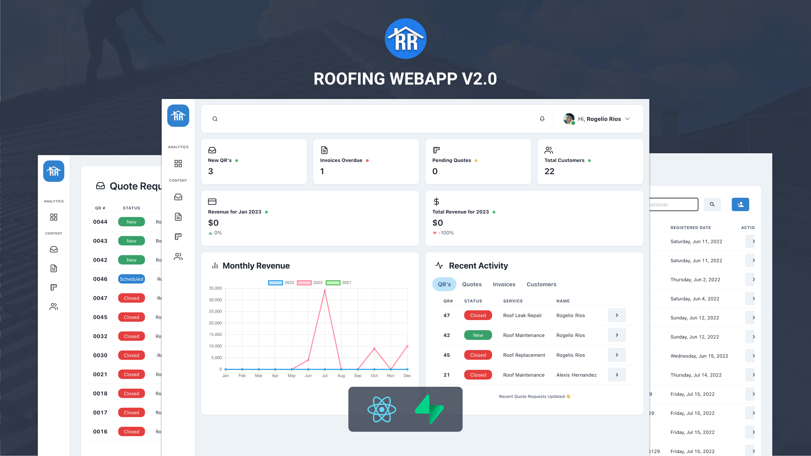
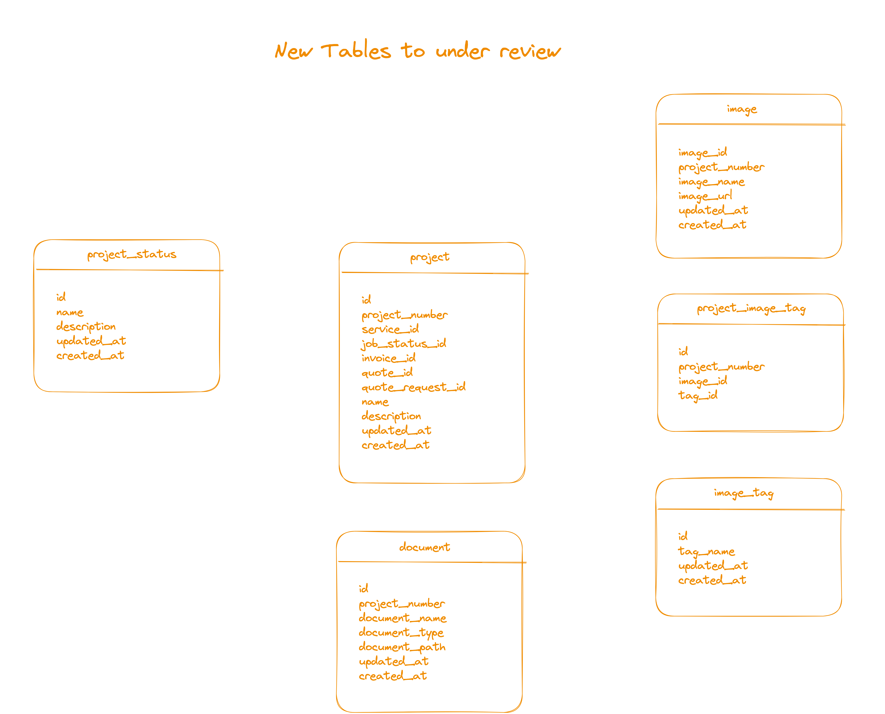

<p align="center">
  <br>
  <!--  -->
</p>
<h1 align="center">The Roofing App</h1>
<p align="center">
  <b>Introducing a high-performance, visually-stunning web application for Rios Roofing Company, built from the ground up using React.js and Supabase technology. 🚀</b>
  <br><br>
  
  
  <a title="Crowdin" target="_blank" href="https://crowdin.com/project/cider-music"></a>
    <a title="Crowdin" target="_blank" href="https://crowdin.com/project/cider-music"></a>
  <br>

</p>

</br>
<p align="center">
  
</p>

## Overview

#### My web application is designed to help roofing companies streamline their data management and improve customer communication. It allows businesses to store, manage and access key information such as invoices, quotes, customer details and leads, reducing the time and effort required to create and send invoices and quotes to customers. The application also features a dashboard to easily track company progress and manage leads received through the company website, resulting in more efficient and effective business operations.

</br>

## Usage

This section will include installation intructions, running the app, additional resources, and deployment guides.

</br>

#### 1. Install npm packages for react-app

```
  npm install
```

</br>

#### 2. Add .env variables to root of react-app folder

```
  //Create file named .env
  touch .env
```

```
  REACT_APP_SUPABASE_URL=
  REACT_APP_SUPABASE_KEY=
```

</br>
To allow communication between the client-side and the DB, add the Supabase URL and private key to the .env file by copying them over.

In order to obtain that information you must first start by visiting [Supabase and create an account here](https://app.supabase.com/). Once you create the account [Create a new project](https://app.supabase.com/) in the Supabase Dashboard. You can name the project whatever name you want and for the sake for dev work you can name it roofing-db-dev.

Next thing to obtain is Project URL & public API (anon) key [click here](https://app.supabase.com/project/_/settings/api) to be used in the .env file. Due to the fact that Supabase provides a API, the use of a Express.js server has been deprecated for now.
</br>

Before you can start the application please go to the Setup Database Schema section of this document.
</br>
</br>

#### 3. Start app from client folder by running this command in the terminal

```
  npm start
```

After installing the necessary packages and creating your Supabase instance, including adding the URL and Key, you can start the app by running the command. The application will be available on localhost:3000 and will prompt you to login. The login credentials can be managed in the settings of the Supabase dashboard. To ensure proper functionality, please use the provided schema for the database, including the names and fields as outlined.
</br>
</br>

### Deploy localy as a docker container

This subsection is meant to be used once you want to deploy just the client app as a docker container.

#### 4. Build to docker image for deployment

```
  docker build -t my-roofing-app .
```

</br>

#### 5. Run to docker image for deployment in port 80

```
  docker run -p 80:80 my-roofing-app
```

## Setting up DB Schema & Core Data


The purpose of this section is to provide SQL scripts that will get you up in running automatically for the app to function correctly. Without this section they app will be empty and might error out since the schema is required.

Currently as for version 2.0 and greater of the application it will rely on a total of 12 tables:

- customer
- customer_type
- invoice
- invoice_line_service
- invoice_payment
- invoice_status
- quote
- quote_line_item
- quote_request
- quote_request_status
- quote_status
- service

Tables currently under review for v2.2 and greater:

- project
- project_image_tag
- image
- image_tag
- document
- project_status



These tables will play in a role of gathering the invoices, quotes, quote request, images, documents into one place. This way we can create multiple invoices for one project and later down the line we can track expense based by a project instead of just using the invoice for the hub for a job.

Below is the code that you must run in the "SQL Editor" section in you project in [Supabase](https://app.supabase.com) by copying it and running that code.
(Note that this also includes triggers and functions that have been creating during the development of the app.)

<details>
<summary>Click here to toggle SQL code for schema only of DB</summary>

```SQL
--
-- TOC entry 429 (class 1255 OID 26745)
-- Name: f_delfunc(text); Type: FUNCTION; Schema: public; Owner: postgres
--

CREATE FUNCTION public.f_delfunc(_name text, OUT functions_dropped integer) RETURNS integer
    LANGUAGE plpgsql
    AS $$
-- drop all functions with given _name in the current search_path, regardless of function parameters
DECLARE
   _sql text;
BEGIN
   SELECT count(*)::int
        , 'DROP FUNCTION ' || string_agg(oid::regprocedure::text, '; DROP FUNCTION ')
   FROM   pg_catalog.pg_proc
   WHERE  proname = _name
   AND    pg_function_is_visible(oid)  -- restrict to current search_path
   INTO   functions_dropped, _sql;     -- count only returned if subsequent DROPs succeed

   IF functions_dropped > 0 THEN       -- only if function(s) found
     EXECUTE _sql;
   END IF;
END
$$;


ALTER FUNCTION public.f_delfunc(_name text, OUT functions_dropped integer) OWNER TO postgres;

--
-- TOC entry 412 (class 1255 OID 26769)
-- Name: get_current_month_revenue_with_percentage_change(); Type: FUNCTION; Schema: public; Owner: postgres
--

CREATE FUNCTION public.get_current_month_revenue_with_percentage_change() RETURNS TABLE(monthly_revenue double precision, percentage_change double precision)
    LANGUAGE plpgsql
    AS $$
BEGIN
  RETURN QUERY
WITH current_month_revenue AS (
    SELECT COALESCE(sum(amount), 0) as monthly_revenue
    FROM invoice_payment
    WHERE date_received >= date_trunc('month', CURRENT_DATE)
)
, last_month_revenue AS (
    SELECT COALESCE(sum(amount), 0) as last_month_revenue
    FROM invoice_payment
    WHERE date_received >= date_trunc('month', CURRENT_DATE - INTERVAL '1 month')
    AND date_received < date_trunc('month', CURRENT_DATE)
)
SELECT
    current_month_revenue.monthly_revenue,
    (current_month_revenue.monthly_revenue /
    CASE
        WHEN last_month_revenue.last_month_revenue = 0 THEN 1
        ELSE last_month_revenue.last_month_revenue
    END) as percent_change
FROM current_month_revenue, last_month_revenue;

END
$$;


ALTER FUNCTION public.get_current_month_revenue_with_percentage_change() OWNER TO postgres;

--
-- TOC entry 413 (class 1255 OID 26771)
-- Name: get_current_year_total_revenue_with_percent_change(); Type: FUNCTION; Schema: public; Owner: postgres
--

CREATE FUNCTION public.get_current_year_total_revenue_with_percent_change() RETURNS TABLE(current_year_revenue double precision, percent_change double precision)
    LANGUAGE plpgsql
    AS $$
BEGIN
  RETURN QUERY
WITH current_year_revenue AS (
    SELECT COALESCE(sum(amount), 0) as current_year_revenue
    FROM invoice_payment
    WHERE date_received >= date_trunc('year', CURRENT_DATE)
)
, last_year_revenue AS (
    SELECT COALESCE(sum(amount), 0) as last_year_revenue
    FROM invoice_payment
    WHERE date_received >= date_trunc('year', CURRENT_DATE - INTERVAL '1 year')
    AND date_received < date_trunc('year', CURRENT_DATE)
)
SELECT
    current_year_revenue.current_year_revenue,
    (current_year_revenue.current_year_revenue - last_year_revenue.last_year_revenue) /
    CASE
        WHEN last_year_revenue.last_year_revenue = 0 THEN 1
        ELSE last_year_revenue.last_year_revenue
    END * 100 as percent_change
FROM current_year_revenue, last_year_revenue;


END
$$;


ALTER FUNCTION public.get_current_year_total_revenue_with_percent_change() OWNER TO postgres;

--
-- TOC entry 403 (class 1255 OID 26767)
-- Name: get_monthly_invoice_revenue_dataset(numeric); Type: FUNCTION; Schema: public; Owner: postgres
--

CREATE FUNCTION public.get_monthly_invoice_revenue_dataset(year_input numeric) RETURNS TABLE(month integer, month_total double precision)
    LANGUAGE plpgsql
    AS $$
BEGIN
  RETURN QUERY
WITH months AS (
  SELECT
    generate_series(1, 12) AS month
)
SELECT
  months.month,
  COALESCE(SUM(invoice_payment.amount),0) AS month_total
FROM
  months
  LEFT JOIN invoice_payment ON months.month = EXTRACT(MONTH FROM invoice_payment.date_received)
    AND EXTRACT(YEAR FROM invoice_payment.date_received) = year_input
GROUP BY
  months.month
ORDER BY
  months.month;

END
$$;


ALTER FUNCTION public.get_monthly_invoice_revenue_dataset(year_input numeric) OWNER TO postgres;

--
-- TOC entry 415 (class 1255 OID 26813)
-- Name: update_invoice_amount_due(); Type: FUNCTION; Schema: public; Owner: postgres
--

CREATE FUNCTION public.update_invoice_amount_due() RETURNS trigger
    LANGUAGE plpgsql
    AS $$
BEGIN
  IF (TG_OP = 'DELETE') THEN
    UPDATE invoice
    SET amount_due = amount_due + OLD.amount,
    updated_at = current_timestamp
    WHERE invoice_number = OLD.invoice_id;
  ELSE
    UPDATE invoice
    SET amount_due = total - (SELECT COALESCE(SUM(amount), 0) FROM invoice_payment WHERE invoice_id = NEW.invoice_id),
    updated_at = current_timestamp
    WHERE invoice_number = NEW.invoice_id;
  END IF;

  RETURN NEW;
END;
$$;


ALTER FUNCTION public.update_invoice_amount_due() OWNER TO postgres;

--
-- TOC entry 414 (class 1255 OID 26811)
-- Name: update_invoice_amount_due_on_payment(); Type: FUNCTION; Schema: public; Owner: postgres
--

CREATE FUNCTION public.update_invoice_amount_due_on_payment() RETURNS trigger
    LANGUAGE plpgsql
    AS $$
BEGIN
    UPDATE invoice
    SET amount_due = (total - NEW.amount)
    WHERE invoice_number = NEW.invoice_id;
    RETURN NEW;
END;
$$;


ALTER FUNCTION public.update_invoice_amount_due_on_payment() OWNER TO postgres;

--
-- TOC entry 416 (class 1255 OID 26816)
-- Name: update_invoice_totals(); Type: FUNCTION; Schema: public; Owner: postgres
--

CREATE FUNCTION public.update_invoice_totals() RETURNS trigger
    LANGUAGE plpgsql
    AS $$
BEGIN
  IF (TG_OP = 'DELETE') THEN
    UPDATE invoice
    SET subtotal = subtotal - OLD.amount,
        total = total - OLD.amount,
        amount_due = amount_due - OLD.amount,
        updated_at = current_timestamp
    WHERE invoice_number = OLD.invoice_id;
  ELSE
    UPDATE invoice
    SET subtotal = (SELECT COALESCE(SUM(amount), 0) FROM invoice_line_service WHERE invoice_id = NEW.invoice_id),
        total = (SELECT COALESCE(SUM(amount), 0) FROM invoice_line_service WHERE invoice_id = NEW.invoice_id),
        amount_due = (SELECT COALESCE(SUM(amount), 0) FROM invoice_line_service WHERE invoice_id = NEW.invoice_id) - (SELECT COALESCE(SUM(amount), 0) FROM invoice_payment WHERE invoice_id = NEW.invoice_id),
        updated_at = current_timestamp
    WHERE invoice_number = NEW.invoice_id;
  END IF;

  RETURN NEW;
END;
$$;


ALTER FUNCTION public.update_invoice_totals() OWNER TO postgres;

--
-- TOC entry 430 (class 1255 OID 26962)
-- Name: update_quote_totals(); Type: FUNCTION; Schema: public; Owner: postgres
--

CREATE FUNCTION public.update_quote_totals() RETURNS trigger
    LANGUAGE plpgsql
    AS $$
BEGIN
  IF (TG_OP = 'DELETE') THEN
    UPDATE quote
    SET subtotal = subtotal - OLD.amount,
        total = total - OLD.amount,
        updated_at = current_timestamp
    WHERE quote_number = OLD.quote_id;
  ELSE
    UPDATE quote
    SET subtotal = (SELECT COALESCE(SUM(amount), 0) FROM quote_line_item WHERE quote_id = NEW.quote_id),
        total = (SELECT COALESCE(SUM(amount), 0) FROM quote_line_item WHERE quote_id = NEW.quote_id),
        updated_at = current_timestamp
    WHERE quote_number = NEW.quote_id;
  END IF;

  RETURN NEW;
END;
$$;


ALTER FUNCTION public.update_quote_totals() OWNER TO postgres;

SET default_tablespace = '';

SET default_table_access_method = heap;

--
-- TOC entry 251 (class 1259 OID 26124)
-- Name: customer; Type: TABLE; Schema: public; Owner: postgres
--

CREATE TABLE public.customer (
    id bigint NOT NULL,
    customer_type_id bigint NOT NULL,
    first_name text NOT NULL,
    last_name text NOT NULL,
    street_address text,
    city text,
    zipcode text,
    phone_number text,
    email text NOT NULL,
    updated_at timestamp without time zone,
    created_at timestamp with time zone DEFAULT now(),
    company_name text,
    state text
);


ALTER TABLE public.customer OWNER TO postgres;

--
-- TOC entry 3070 (class 0 OID 0)
-- Dependencies: 251
-- Name: TABLE customer; Type: COMMENT; Schema: public; Owner: postgres
--

COMMENT ON TABLE public.customer IS 'Table that stores all the customers for roofing company';


--
-- TOC entry 252 (class 1259 OID 26130)
-- Name: customer_id_seq; Type: SEQUENCE; Schema: public; Owner: postgres
--

ALTER TABLE public.customer ALTER COLUMN id ADD GENERATED BY DEFAULT AS IDENTITY (
    SEQUENCE NAME public.customer_id_seq
    START WITH 1
    INCREMENT BY 1
    NO MINVALUE
    NO MAXVALUE
    CACHE 1
);


--
-- TOC entry 253 (class 1259 OID 26131)
-- Name: customer_type; Type: TABLE; Schema: public; Owner: postgres
--

CREATE TABLE public.customer_type (
    id bigint NOT NULL,
    name text NOT NULL,
    description text NOT NULL,
    updated_at timestamp without time zone,
    created_at timestamp with time zone DEFAULT now()
);


ALTER TABLE public.customer_type OWNER TO postgres;

--
-- TOC entry 3073 (class 0 OID 0)
-- Dependencies: 253
-- Name: TABLE customer_type; Type: COMMENT; Schema: public; Owner: postgres
--

COMMENT ON TABLE public.customer_type IS 'Table that stores all types of customer the roofing company deals with';


--
-- TOC entry 254 (class 1259 OID 26137)
-- Name: customer_type_id_seq; Type: SEQUENCE; Schema: public; Owner: postgres
--

ALTER TABLE public.customer_type ALTER COLUMN id ADD GENERATED BY DEFAULT AS IDENTITY (
    SEQUENCE NAME public.customer_type_id_seq
    START WITH 1
    INCREMENT BY 1
    NO MINVALUE
    NO MAXVALUE
    CACHE 1
);


--
-- TOC entry 255 (class 1259 OID 26150)
-- Name: quote_request; Type: TABLE; Schema: public; Owner: postgres
--

CREATE TABLE public.quote_request (
    id bigint NOT NULL,
    created_at timestamp with time zone DEFAULT now(),
    service_type_id bigint,
    "customer_typeID" bigint NOT NULL,
    "firstName" text,
    "lastName" text,
    "streetAddress" text,
    city text,
    zipcode text,
    email text NOT NULL,
    custom_service text,
    requested_date date,
    est_request_status_id bigint DEFAULT '1'::bigint NOT NULL,
    state text,
    phone_number text,
    updated_at timestamp with time zone
);


ALTER TABLE public.quote_request OWNER TO postgres;

--
-- TOC entry 3076 (class 0 OID 0)
-- Dependencies: 255
-- Name: TABLE quote_request; Type: COMMENT; Schema: public; Owner: postgres
--

COMMENT ON TABLE public.quote_request IS 'Customer request for aa quote based on the service the roofing company offers.';


--
-- TOC entry 3077 (class 0 OID 0)
-- Dependencies: 255
-- Name: COLUMN quote_request.phone_number; Type: COMMENT; Schema: public; Owner: postgres
--

COMMENT ON COLUMN public.quote_request.phone_number IS 'The requesters phone number can be used to schedule or confirm a date where roofing company will visit to measure the home to create a quote.';


--
-- TOC entry 3078 (class 0 OID 0)
-- Dependencies: 255
-- Name: COLUMN quote_request.updated_at; Type: COMMENT; Schema: public; Owner: postgres
--

COMMENT ON COLUMN public.quote_request.updated_at IS 'When changes are made to the data a date will go along side it =.';


--
-- TOC entry 256 (class 1259 OID 26157)
-- Name: estimate_request_id_seq; Type: SEQUENCE; Schema: public; Owner: postgres
--

ALTER TABLE public.quote_request ALTER COLUMN id ADD GENERATED BY DEFAULT AS IDENTITY (
    SEQUENCE NAME public.estimate_request_id_seq
    START WITH 1
    INCREMENT BY 1
    NO MINVALUE
    NO MAXVALUE
    CACHE 1
);


--
-- TOC entry 257 (class 1259 OID 26158)
-- Name: quote_request_status; Type: TABLE; Schema: public; Owner: postgres
--

CREATE TABLE public.quote_request_status (
    id bigint NOT NULL,
    name text NOT NULL,
    description text NOT NULL,
    updated_at timestamp without time zone,
    created_at timestamp with time zone DEFAULT now()
);


ALTER TABLE public.quote_request_status OWNER TO postgres;

--
-- TOC entry 3081 (class 0 OID 0)
-- Dependencies: 257
-- Name: TABLE quote_request_status; Type: COMMENT; Schema: public; Owner: postgres
--

COMMENT ON TABLE public.quote_request_status IS 'Table that stores all the status for a estimate request submitted by the customer';


--
-- TOC entry 258 (class 1259 OID 26164)
-- Name: estimate_request_status_id_seq; Type: SEQUENCE; Schema: public; Owner: postgres
--

ALTER TABLE public.quote_request_status ALTER COLUMN id ADD GENERATED BY DEFAULT AS IDENTITY (
    SEQUENCE NAME public.estimate_request_status_id_seq
    START WITH 1
    INCREMENT BY 1
    NO MINVALUE
    NO MAXVALUE
    CACHE 1
);


--
-- TOC entry 259 (class 1259 OID 26172)
-- Name: invoice; Type: TABLE; Schema: public; Owner: postgres
--

CREATE TABLE public.invoice (
    id bigint NOT NULL,
    invoice_number bigint NOT NULL,
    customer_id bigint NOT NULL,
    service_type_id bigint,
    invoice_status_id bigint,
    invoice_date date,
    issue_date date,
    due_date date,
    subtotal double precision,
    total double precision,
    sqft_measurement text,
    note text,
    updated_at timestamp without time zone,
    created_at timestamp with time zone DEFAULT now(),
    bill_from_street_address text DEFAULT '150 Tallant St'::text,
    bill_from_city text DEFAULT 'Houston'::text,
    bill_from_zipcode text DEFAULT '77076'::text,
    bill_to_street_address text,
    bill_to_city text,
    bill_to_state text,
    bill_to_zipcode text,
    cust_note text,
    bill_from_email text,
    bill_from_state text,
    amount_due double precision,
    bill_to boolean DEFAULT false
);


ALTER TABLE public.invoice OWNER TO postgres;

--
-- TOC entry 3084 (class 0 OID 0)
-- Dependencies: 259
-- Name: TABLE invoice; Type: COMMENT; Schema: public; Owner: postgres
--

COMMENT ON TABLE public.invoice IS 'Table that stores all the invoices.';


--
-- TOC entry 3085 (class 0 OID 0)
-- Dependencies: 259
-- Name: COLUMN invoice.cust_note; Type: COMMENT; Schema: public; Owner: postgres
--

COMMENT ON COLUMN public.invoice.cust_note IS 'Note meant to be seen by the customer when we send out invoices to them.';


--
-- TOC entry 3086 (class 0 OID 0)
-- Dependencies: 259
-- Name: COLUMN invoice.amount_due; Type: COMMENT; Schema: public; Owner: postgres
--

COMMENT ON COLUMN public.invoice.amount_due IS 'The purpose of this column is to create a field to have where be used as the total due when we subtract total minus payment.';


--
-- TOC entry 3087 (class 0 OID 0)
-- Dependencies: 259
-- Name: COLUMN invoice.bill_to; Type: COMMENT; Schema: public; Owner: postgres
--

COMMENT ON COLUMN public.invoice.bill_to IS 'Boolean Value to determine if to display custom billing info for customer';


--
-- TOC entry 260 (class 1259 OID 26182)
-- Name: invoice_id_seq; Type: SEQUENCE; Schema: public; Owner: postgres
--

ALTER TABLE public.invoice ALTER COLUMN id ADD GENERATED BY DEFAULT AS IDENTITY (
    SEQUENCE NAME public.invoice_id_seq
    START WITH 1
    INCREMENT BY 1
    NO MINVALUE
    NO MAXVALUE
    CACHE 1
);


--
-- TOC entry 261 (class 1259 OID 26183)
-- Name: invoice_line_service; Type: TABLE; Schema: public; Owner: postgres
--

CREATE TABLE public.invoice_line_service (
    id bigint NOT NULL,
    invoice_id bigint NOT NULL,
    service_id bigint NOT NULL,
    sq_ft double precision,
    qty bigint NOT NULL,
    rate double precision,
    amount double precision NOT NULL,
    updated_at timestamp without time zone,
    created_at timestamp with time zone DEFAULT now(),
    description text,
    fixed_item boolean
);


ALTER TABLE public.invoice_line_service OWNER TO postgres;

--
-- TOC entry 3090 (class 0 OID 0)
-- Dependencies: 261
-- Name: COLUMN invoice_line_service.description; Type: COMMENT; Schema: public; Owner: postgres
--

COMMENT ON COLUMN public.invoice_line_service.description IS 'This column describes the service that was done. Such as writing a custom name for it.';


--
-- TOC entry 3091 (class 0 OID 0)
-- Dependencies: 261
-- Name: COLUMN invoice_line_service.fixed_item; Type: COMMENT; Schema: public; Owner: postgres
--

COMMENT ON COLUMN public.invoice_line_service.fixed_item IS 'True or False flag to determine if to use the rate or the fixed are amount.';


--
-- TOC entry 262 (class 1259 OID 26187)
-- Name: invoice_line_service_duplicate_id_seq; Type: SEQUENCE; Schema: public; Owner: postgres
--

ALTER TABLE public.invoice_line_service ALTER COLUMN id ADD GENERATED BY DEFAULT AS IDENTITY (
    SEQUENCE NAME public.invoice_line_service_duplicate_id_seq
    START WITH 1
    INCREMENT BY 1
    NO MINVALUE
    NO MAXVALUE
    CACHE 1
);


--
-- TOC entry 265 (class 1259 OID 26207)
-- Name: invoice_payment; Type: TABLE; Schema: public; Owner: postgres
--

CREATE TABLE public.invoice_payment (
    id bigint NOT NULL,
    invoice_id bigint,
    payment_method text,
    amount double precision,
    updated_at timestamp without time zone,
    created_at timestamp with time zone DEFAULT now(),
    date_received date
);


ALTER TABLE public.invoice_payment OWNER TO postgres;

--
-- TOC entry 3094 (class 0 OID 0)
-- Dependencies: 265
-- Name: TABLE invoice_payment; Type: COMMENT; Schema: public; Owner: postgres
--

COMMENT ON TABLE public.invoice_payment IS 'Table that stores all the payments made to an invoice by the customer';


--
-- TOC entry 3095 (class 0 OID 0)
-- Dependencies: 265
-- Name: COLUMN invoice_payment.date_received; Type: COMMENT; Schema: public; Owner: postgres
--

COMMENT ON COLUMN public.invoice_payment.date_received IS 'The date when company has received payment for a invoice';


--
-- TOC entry 263 (class 1259 OID 26188)
-- Name: invoice_status; Type: TABLE; Schema: public; Owner: postgres
--

CREATE TABLE public.invoice_status (
    id bigint NOT NULL,
    name text,
    description text,
    updated_at timestamp without time zone,
    created_at timestamp with time zone DEFAULT now()
);


ALTER TABLE public.invoice_status OWNER TO postgres;

--
-- TOC entry 3097 (class 0 OID 0)
-- Dependencies: 263
-- Name: TABLE invoice_status; Type: COMMENT; Schema: public; Owner: postgres
--

COMMENT ON TABLE public.invoice_status IS 'Table that stores all the status for the invoices.';


--
-- TOC entry 264 (class 1259 OID 26194)
-- Name: invoice_status_id_seq; Type: SEQUENCE; Schema: public; Owner: postgres
--

ALTER TABLE public.invoice_status ALTER COLUMN id ADD GENERATED BY DEFAULT AS IDENTITY (
    SEQUENCE NAME public.invoice_status_id_seq
    START WITH 1
    INCREMENT BY 1
    NO MINVALUE
    NO MAXVALUE
    CACHE 1
);


--
-- TOC entry 266 (class 1259 OID 26214)
-- Name: payment_id_seq; Type: SEQUENCE; Schema: public; Owner: postgres
--

ALTER TABLE public.invoice_payment ALTER COLUMN id ADD GENERATED BY DEFAULT AS IDENTITY (
    SEQUENCE NAME public.payment_id_seq
    START WITH 1
    INCREMENT BY 1
    NO MINVALUE
    NO MAXVALUE
    CACHE 1
);


--
-- TOC entry 279 (class 1259 OID 26648)
-- Name: quote; Type: TABLE; Schema: public; Owner: postgres
--

CREATE TABLE public.quote (
    id bigint NOT NULL,
    quote_number bigint NOT NULL,
    customer_id bigint NOT NULL,
    status_id bigint NOT NULL,
    issue_date date,
    expiration_date date NOT NULL,
    created_at timestamp with time zone DEFAULT now(),
    service_id bigint NOT NULL,
    subtotal double precision,
    total double precision,
    invoiced_total double precision,
    updated_at timestamp with time zone,
    quote_date date NOT NULL,
    note text,
    measurement_note text,
    cust_note text,
    custom_street_address text,
    custom_city text,
    custom_state text,
    custom_zipcode text
);


ALTER TABLE public.quote OWNER TO postgres;

--
-- TOC entry 3101 (class 0 OID 0)
-- Dependencies: 279
-- Name: TABLE quote; Type: COMMENT; Schema: public; Owner: postgres
--

COMMENT ON TABLE public.quote IS 'To manage roofing quotes that we can provide to customers.';


--
-- TOC entry 3102 (class 0 OID 0)
-- Dependencies: 279
-- Name: COLUMN quote.measurement_note; Type: COMMENT; Schema: public; Owner: postgres
--

COMMENT ON COLUMN public.quote.measurement_note IS 'mean to store the metric of the roof and come up with the estimated price to charge for the job.';


--
-- TOC entry 280 (class 1259 OID 26651)
-- Name: quote_id_seq; Type: SEQUENCE; Schema: public; Owner: postgres
--

ALTER TABLE public.quote ALTER COLUMN id ADD GENERATED BY DEFAULT AS IDENTITY (
    SEQUENCE NAME public.quote_id_seq
    START WITH 1
    INCREMENT BY 1
    NO MINVALUE
    NO MAXVALUE
    CACHE 1
);


--
-- TOC entry 281 (class 1259 OID 26670)
-- Name: quote_line_item; Type: TABLE; Schema: public; Owner: postgres
--

CREATE TABLE public.quote_line_item (
    id bigint NOT NULL,
    quote_id bigint NOT NULL,
    service_id bigint NOT NULL,
    qty bigint NOT NULL,
    amount double precision NOT NULL,
    created_at timestamp with time zone DEFAULT now(),
    updated_at timestamp without time zone,
    rate double precision,
    sq_ft double precision,
    description text NOT NULL,
    fixed_item boolean DEFAULT true
);


ALTER TABLE public.quote_line_item OWNER TO postgres;

--
-- TOC entry 3105 (class 0 OID 0)
-- Dependencies: 281
-- Name: TABLE quote_line_item; Type: COMMENT; Schema: public; Owner: postgres
--

COMMENT ON TABLE public.quote_line_item IS 'Table that stores the line items for each quote.';


--
-- TOC entry 282 (class 1259 OID 26673)
-- Name: quote_item_id_seq; Type: SEQUENCE; Schema: public; Owner: postgres
--

ALTER TABLE public.quote_line_item ALTER COLUMN id ADD GENERATED BY DEFAULT AS IDENTITY (
    SEQUENCE NAME public.quote_item_id_seq
    START WITH 1
    INCREMENT BY 1
    NO MINVALUE
    NO MAXVALUE
    CACHE 1
);


--
-- TOC entry 284 (class 1259 OID 26871)
-- Name: quote_status; Type: TABLE; Schema: public; Owner: postgres
--

CREATE TABLE public.quote_status (
    id bigint NOT NULL,
    name text,
    description text,
    created_at timestamp with time zone DEFAULT now(),
    updated_at timestamp with time zone
);


ALTER TABLE public.quote_status OWNER TO postgres;

--
-- TOC entry 285 (class 1259 OID 26874)
-- Name: quote_status_id_seq; Type: SEQUENCE; Schema: public; Owner: postgres
--

ALTER TABLE public.quote_status ALTER COLUMN id ADD GENERATED BY DEFAULT AS IDENTITY (
    SEQUENCE NAME public.quote_status_id_seq
    START WITH 1
    INCREMENT BY 1
    NO MINVALUE
    NO MAXVALUE
    CACHE 1
);


--
-- TOC entry 267 (class 1259 OID 26222)
-- Name: service; Type: TABLE; Schema: public; Owner: postgres
--

CREATE TABLE public.service (
    id bigint NOT NULL,
    name text NOT NULL,
    description text NOT NULL,
    updated_at timestamp without time zone,
    created_at timestamp with time zone DEFAULT now(),
    default_price text
);


ALTER TABLE public.service OWNER TO postgres;

--
-- TOC entry 3110 (class 0 OID 0)
-- Dependencies: 267
-- Name: TABLE service; Type: COMMENT; Schema: public; Owner: postgres
--

COMMENT ON TABLE public.service IS 'A list of all the types of services the roofing company can provide to their customers.';


--
-- TOC entry 3111 (class 0 OID 0)
-- Dependencies: 267
-- Name: COLUMN service.default_price; Type: COMMENT; Schema: public; Owner: postgres
--

COMMENT ON COLUMN public.service.default_price IS 'Due to the fact that my services don''t have a set price and requires a quote. We will store a default price for the service such as $300 per sq or $100 per hour. ';


--
-- TOC entry 268 (class 1259 OID 26228)
-- Name: service_type_id_seq; Type: SEQUENCE; Schema: public; Owner: postgres
--

ALTER TABLE public.service ALTER COLUMN id ADD GENERATED BY DEFAULT AS IDENTITY (
    SEQUENCE NAME public.service_type_id_seq
    START WITH 1
    INCREMENT BY 1
    NO MINVALUE
    NO MAXVALUE
    CACHE 1
);


--
-- TOC entry 2838 (class 2606 OID 26293)
-- Name: customer customer_pkey; Type: CONSTRAINT; Schema: public; Owner: postgres
--

ALTER TABLE ONLY public.customer
    ADD CONSTRAINT customer_pkey PRIMARY KEY (id);


--
-- TOC entry 2840 (class 2606 OID 26295)
-- Name: customer_type customer_type_pkey; Type: CONSTRAINT; Schema: public; Owner: postgres
--

ALTER TABLE ONLY public.customer_type
    ADD CONSTRAINT customer_type_pkey PRIMARY KEY (id);


--
-- TOC entry 2842 (class 2606 OID 26303)
-- Name: quote_request estimate_request_id_key; Type: CONSTRAINT; Schema: public; Owner: postgres
--

ALTER TABLE ONLY public.quote_request
    ADD CONSTRAINT estimate_request_id_key UNIQUE (id);


--
-- TOC entry 2844 (class 2606 OID 26305)
-- Name: quote_request estimate_request_pkey; Type: CONSTRAINT; Schema: public; Owner: postgres
--

ALTER TABLE ONLY public.quote_request
    ADD CONSTRAINT estimate_request_pkey PRIMARY KEY (id);


--
-- TOC entry 2846 (class 2606 OID 26307)
-- Name: quote_request_status estimate_request_status_pkey; Type: CONSTRAINT; Schema: public; Owner: postgres
--

ALTER TABLE ONLY public.quote_request_status
    ADD CONSTRAINT estimate_request_status_pkey PRIMARY KEY (id);


--
-- TOC entry 2848 (class 2606 OID 26311)
-- Name: invoice invoice_invoice_number_key; Type: CONSTRAINT; Schema: public; Owner: postgres
--

ALTER TABLE ONLY public.invoice
    ADD CONSTRAINT invoice_invoice_number_key UNIQUE (invoice_number);


--
-- TOC entry 2852 (class 2606 OID 26313)
-- Name: invoice_line_service invoice_line_service_duplicate_pkey; Type: CONSTRAINT; Schema: public; Owner: postgres
--

ALTER TABLE ONLY public.invoice_line_service
    ADD CONSTRAINT invoice_line_service_duplicate_pkey PRIMARY KEY (id);


--
-- TOC entry 2850 (class 2606 OID 26315)
-- Name: invoice invoice_pkey; Type: CONSTRAINT; Schema: public; Owner: postgres
--

ALTER TABLE ONLY public.invoice
    ADD CONSTRAINT invoice_pkey PRIMARY KEY (id);


--
-- TOC entry 2854 (class 2606 OID 26317)
-- Name: invoice_status invoice_status_pkey; Type: CONSTRAINT; Schema: public; Owner: postgres
--

ALTER TABLE ONLY public.invoice_status
    ADD CONSTRAINT invoice_status_pkey PRIMARY KEY (id);


--
-- TOC entry 2856 (class 2606 OID 26323)
-- Name: invoice_payment payment_pkey; Type: CONSTRAINT; Schema: public; Owner: postgres
--

ALTER TABLE ONLY public.invoice_payment
    ADD CONSTRAINT payment_pkey PRIMARY KEY (id);


--
-- TOC entry 2864 (class 2606 OID 26679)
-- Name: quote_line_item quote_item_pkey; Type: CONSTRAINT; Schema: public; Owner: postgres
--

ALTER TABLE ONLY public.quote_line_item
    ADD CONSTRAINT quote_item_pkey PRIMARY KEY (id);


--
-- TOC entry 2860 (class 2606 OID 26659)
-- Name: quote quote_pkey; Type: CONSTRAINT; Schema: public; Owner: postgres
--

ALTER TABLE ONLY public.quote
    ADD CONSTRAINT quote_pkey PRIMARY KEY (id);


--
-- TOC entry 2862 (class 2606 OID 26656)
-- Name: quote quote_quote_number_key; Type: CONSTRAINT; Schema: public; Owner: postgres
--

ALTER TABLE ONLY public.quote
    ADD CONSTRAINT quote_quote_number_key UNIQUE (quote_number);


--
-- TOC entry 2866 (class 2606 OID 26882)
-- Name: quote_status quote_status_pkey; Type: CONSTRAINT; Schema: public; Owner: postgres
--

ALTER TABLE ONLY public.quote_status
    ADD CONSTRAINT quote_status_pkey PRIMARY KEY (id);


--
-- TOC entry 2858 (class 2606 OID 26327)
-- Name: service service_type_pkey; Type: CONSTRAINT; Schema: public; Owner: postgres
--

ALTER TABLE ONLY public.service
    ADD CONSTRAINT service_type_pkey PRIMARY KEY (id);


--
-- TOC entry 2883 (class 2620 OID 26819)
-- Name: invoice_payment update_amount_due; Type: TRIGGER; Schema: public; Owner: postgres
--

CREATE TRIGGER update_amount_due AFTER INSERT OR DELETE OR UPDATE ON public.invoice_payment FOR EACH ROW EXECUTE FUNCTION public.update_invoice_amount_due();


--
-- TOC entry 2882 (class 2620 OID 26818)
-- Name: invoice_line_service update_invoice_totals; Type: TRIGGER; Schema: public; Owner: postgres
--

CREATE TRIGGER update_invoice_totals AFTER INSERT OR DELETE OR UPDATE ON public.invoice_line_service FOR EACH ROW EXECUTE FUNCTION public.update_invoice_totals();


--
-- TOC entry 2884 (class 2620 OID 26963)
-- Name: quote_line_item update_quote_totals; Type: TRIGGER; Schema: public; Owner: postgres
--

CREATE TRIGGER update_quote_totals AFTER INSERT OR DELETE OR UPDATE ON public.quote_line_item FOR EACH ROW EXECUTE FUNCTION public.update_quote_totals();


--
-- TOC entry 2867 (class 2606 OID 26398)
-- Name: customer customer_customer_type_id_fkey; Type: FK CONSTRAINT; Schema: public; Owner: postgres
--

ALTER TABLE ONLY public.customer
    ADD CONSTRAINT customer_customer_type_id_fkey FOREIGN KEY (customer_type_id) REFERENCES public.customer_type(id);


--
-- TOC entry 2871 (class 2606 OID 26643)
-- Name: invoice invoice_customer_id_fkey; Type: FK CONSTRAINT; Schema: public; Owner: postgres
--

ALTER TABLE ONLY public.invoice
    ADD CONSTRAINT invoice_customer_id_fkey FOREIGN KEY (customer_id) REFERENCES public.customer(id);


--
-- TOC entry 2872 (class 2606 OID 26448)
-- Name: invoice invoice_invoice_status_id_fkey; Type: FK CONSTRAINT; Schema: public; Owner: postgres
--

ALTER TABLE ONLY public.invoice
    ADD CONSTRAINT invoice_invoice_status_id_fkey FOREIGN KEY (invoice_status_id) REFERENCES public.invoice_status(id);


--
-- TOC entry 2874 (class 2606 OID 26953)
-- Name: invoice_line_service invoice_line_service_invoice_id_fkey; Type: FK CONSTRAINT; Schema: public; Owner: postgres
--

ALTER TABLE ONLY public.invoice_line_service
    ADD CONSTRAINT invoice_line_service_invoice_id_fkey FOREIGN KEY (invoice_id) REFERENCES public.invoice(invoice_number);


--
-- TOC entry 2875 (class 2606 OID 26836)
-- Name: invoice_line_service invoice_line_service_service_id_fkey; Type: FK CONSTRAINT; Schema: public; Owner: postgres
--

ALTER TABLE ONLY public.invoice_line_service
    ADD CONSTRAINT invoice_line_service_service_id_fkey FOREIGN KEY (service_id) REFERENCES public.service(id);


--
-- TOC entry 2876 (class 2606 OID 26972)
-- Name: invoice_payment invoice_payment_invoice_id_fkey; Type: FK CONSTRAINT; Schema: public; Owner: postgres
--

ALTER TABLE ONLY public.invoice_payment
    ADD CONSTRAINT invoice_payment_invoice_id_fkey FOREIGN KEY (invoice_id) REFERENCES public.invoice(invoice_number);


--
-- TOC entry 2873 (class 2606 OID 26463)
-- Name: invoice invoice_service_type_id_fkey; Type: FK CONSTRAINT; Schema: public; Owner: postgres
--

ALTER TABLE ONLY public.invoice
    ADD CONSTRAINT invoice_service_type_id_fkey FOREIGN KEY (service_type_id) REFERENCES public.service(id);


--
-- TOC entry 2877 (class 2606 OID 26895)
-- Name: quote quote_customer_id_fkey; Type: FK CONSTRAINT; Schema: public; Owner: postgres
--

ALTER TABLE ONLY public.quote
    ADD CONSTRAINT quote_customer_id_fkey FOREIGN KEY (customer_id) REFERENCES public.customer(id);


--
-- TOC entry 2880 (class 2606 OID 26964)
-- Name: quote_line_item quote_line_item_quote_id_fkey; Type: FK CONSTRAINT; Schema: public; Owner: postgres
--

ALTER TABLE ONLY public.quote_line_item
    ADD CONSTRAINT quote_line_item_quote_id_fkey FOREIGN KEY (quote_id) REFERENCES public.quote(quote_number);


--
-- TOC entry 2881 (class 2606 OID 26915)
-- Name: quote_line_item quote_line_item_service_id_fkey; Type: FK CONSTRAINT; Schema: public; Owner: postgres
--

ALTER TABLE ONLY public.quote_line_item
    ADD CONSTRAINT quote_line_item_service_id_fkey FOREIGN KEY (service_id) REFERENCES public.service(id);


--
-- TOC entry 2868 (class 2606 OID 26700)
-- Name: quote_request quote_request_customer_typeID_fkey; Type: FK CONSTRAINT; Schema: public; Owner: postgres
--

ALTER TABLE ONLY public.quote_request
    ADD CONSTRAINT "quote_request_customer_typeID_fkey" FOREIGN KEY ("customer_typeID") REFERENCES public.customer_type(id);


--
-- TOC entry 2869 (class 2606 OID 26705)
-- Name: quote_request quote_request_est_request_status_id_fkey; Type: FK CONSTRAINT; Schema: public; Owner: postgres
--

ALTER TABLE ONLY public.quote_request
    ADD CONSTRAINT quote_request_est_request_status_id_fkey FOREIGN KEY (est_request_status_id) REFERENCES public.quote_request_status(id);


--
-- TOC entry 2870 (class 2606 OID 26695)
-- Name: quote_request quote_request_service_type_id_fkey; Type: FK CONSTRAINT; Schema: public; Owner: postgres
--

ALTER TABLE ONLY public.quote_request
    ADD CONSTRAINT quote_request_service_type_id_fkey FOREIGN KEY (service_type_id) REFERENCES public.service(id);


--
-- TOC entry 2878 (class 2606 OID 26905)
-- Name: quote quote_service_id_fkey; Type: FK CONSTRAINT; Schema: public; Owner: postgres
--

ALTER TABLE ONLY public.quote
    ADD CONSTRAINT quote_service_id_fkey FOREIGN KEY (service_id) REFERENCES public.service(id);


--
-- TOC entry 2879 (class 2606 OID 26900)
-- Name: quote quote_status_id_fkey; Type: FK CONSTRAINT; Schema: public; Owner: postgres
--

ALTER TABLE ONLY public.quote
    ADD CONSTRAINT quote_status_id_fkey FOREIGN KEY (status_id) REFERENCES public.quote_status(id);


--
-- TOC entry 3044 (class 3256 OID 27037)
-- Name: customer Enable all for authenticated users only; Type: POLICY; Schema: public; Owner: postgres
--

CREATE POLICY "Enable all for authenticated users only" ON public.customer TO authenticated USING (true) WITH CHECK (true);


--
-- TOC entry 3046 (class 3256 OID 27022)
-- Name: customer_type Enable all operations for authenticated users only; Type: POLICY; Schema: public; Owner: postgres
--

CREATE POLICY "Enable all operations for authenticated users only" ON public.customer_type TO authenticated USING (true) WITH CHECK (true);


--
-- TOC entry 3051 (class 3256 OID 27029)
-- Name: quote_line_item Enable all operations for authenticated users only; Type: POLICY; Schema: public; Owner: postgres
--

CREATE POLICY "Enable all operations for authenticated users only" ON public.quote_line_item TO authenticated USING (true) WITH CHECK (true);


--
-- TOC entry 3054 (class 3256 OID 27042)
-- Name: quote_request Enable all operations for authenticated users only; Type: POLICY; Schema: public; Owner: postgres
--

CREATE POLICY "Enable all operations for authenticated users only" ON public.quote_request TO authenticated USING (true) WITH CHECK (true);


--
-- TOC entry 3040 (class 3256 OID 27032)
-- Name: quote_request_status Enable all operations for authenticated users only; Type: POLICY; Schema: public; Owner: postgres
--

CREATE POLICY "Enable all operations for authenticated users only" ON public.quote_request_status TO authenticated USING (true) WITH CHECK (true);


--
-- TOC entry 3041 (class 3256 OID 27033)
-- Name: quote_status Enable all operations for authenticated users only; Type: POLICY; Schema: public; Owner: postgres
--

CREATE POLICY "Enable all operations for authenticated users only" ON public.quote_status TO authenticated USING (true) WITH CHECK (true);


--
-- TOC entry 3043 (class 3256 OID 27035)
-- Name: service Enable all operations for authenticated users only; Type: POLICY; Schema: public; Owner: postgres
--

CREATE POLICY "Enable all operations for authenticated users only" ON public.service TO authenticated USING (true) WITH CHECK (true);


--
-- TOC entry 3047 (class 3256 OID 27023)
-- Name: invoice Enable all operations insert for authenticated users only; Type: POLICY; Schema: public; Owner: postgres
--

CREATE POLICY "Enable all operations insert for authenticated users only" ON public.invoice TO authenticated USING (true) WITH CHECK (true);


--
-- TOC entry 3045 (class 3256 OID 27024)
-- Name: invoice_line_service Enable all operations insert for authenticated users only; Type: POLICY; Schema: public; Owner: postgres
--

CREATE POLICY "Enable all operations insert for authenticated users only" ON public.invoice_line_service TO authenticated USING (true) WITH CHECK (true);


--
-- TOC entry 3048 (class 3256 OID 27025)
-- Name: invoice_payment Enable all operations insert for authenticated users only; Type: POLICY; Schema: public; Owner: postgres
--

CREATE POLICY "Enable all operations insert for authenticated users only" ON public.invoice_payment TO authenticated USING (true) WITH CHECK (true);


--
-- TOC entry 3049 (class 3256 OID 27027)
-- Name: invoice_status Enable all operations insert for authenticated users only; Type: POLICY; Schema: public; Owner: postgres
--

CREATE POLICY "Enable all operations insert for authenticated users only" ON public.invoice_status TO authenticated USING (true) WITH CHECK (true);


--
-- TOC entry 3050 (class 3256 OID 27028)
-- Name: quote Enable all operations insert for authenticated users only; Type: POLICY; Schema: public; Owner: postgres
--

CREATE POLICY "Enable all operations insert for authenticated users only" ON public.quote TO authenticated USING (true) WITH CHECK (true);


--
-- TOC entry 3053 (class 3256 OID 27040)
-- Name: quote_request Enable insert access for all users; Type: POLICY; Schema: public; Owner: postgres
--

CREATE POLICY "Enable insert access for all users" ON public.quote_request FOR INSERT WITH CHECK (true);


--
-- TOC entry 3052 (class 3256 OID 27041)
-- Name: quote_request Enable read access for all users; Type: POLICY; Schema: public; Owner: postgres
--

CREATE POLICY "Enable read access for all users" ON public.quote_request FOR SELECT USING (true);


--
-- TOC entry 3042 (class 3256 OID 27034)
-- Name: service Enable read access for all users; Type: POLICY; Schema: public; Owner: postgres
--

CREATE POLICY "Enable read access for all users" ON public.service FOR SELECT USING (true);


--
-- TOC entry 3028 (class 0 OID 26124)
-- Dependencies: 251
-- Name: customer; Type: ROW SECURITY; Schema: public; Owner: postgres
--

ALTER TABLE public.customer ENABLE ROW LEVEL SECURITY;

--
-- TOC entry 3029 (class 0 OID 26131)
-- Dependencies: 253
-- Name: customer_type; Type: ROW SECURITY; Schema: public; Owner: postgres
--

ALTER TABLE public.customer_type ENABLE ROW LEVEL SECURITY;

--
-- TOC entry 3032 (class 0 OID 26172)
-- Dependencies: 259
-- Name: invoice; Type: ROW SECURITY; Schema: public; Owner: postgres
--

ALTER TABLE public.invoice ENABLE ROW LEVEL SECURITY;

--
-- TOC entry 3033 (class 0 OID 26183)
-- Dependencies: 261
-- Name: invoice_line_service; Type: ROW SECURITY; Schema: public; Owner: postgres
--

ALTER TABLE public.invoice_line_service ENABLE ROW LEVEL SECURITY;

--
-- TOC entry 3035 (class 0 OID 26207)
-- Dependencies: 265
-- Name: invoice_payment; Type: ROW SECURITY; Schema: public; Owner: postgres
--

ALTER TABLE public.invoice_payment ENABLE ROW LEVEL SECURITY;

--
-- TOC entry 3034 (class 0 OID 26188)
-- Dependencies: 263
-- Name: invoice_status; Type: ROW SECURITY; Schema: public; Owner: postgres
--

ALTER TABLE public.invoice_status ENABLE ROW LEVEL SECURITY;

--
-- TOC entry 3037 (class 0 OID 26648)
-- Dependencies: 279
-- Name: quote; Type: ROW SECURITY; Schema: public; Owner: postgres
--

ALTER TABLE public.quote ENABLE ROW LEVEL SECURITY;

--
-- TOC entry 3038 (class 0 OID 26670)
-- Dependencies: 281
-- Name: quote_line_item; Type: ROW SECURITY; Schema: public; Owner: postgres
--

ALTER TABLE public.quote_line_item ENABLE ROW LEVEL SECURITY;

--
-- TOC entry 3030 (class 0 OID 26150)
-- Dependencies: 255
-- Name: quote_request; Type: ROW SECURITY; Schema: public; Owner: postgres
--

ALTER TABLE public.quote_request ENABLE ROW LEVEL SECURITY;

--
-- TOC entry 3031 (class 0 OID 26158)
-- Dependencies: 257
-- Name: quote_request_status; Type: ROW SECURITY; Schema: public; Owner: postgres
--

ALTER TABLE public.quote_request_status ENABLE ROW LEVEL SECURITY;

--
-- TOC entry 3039 (class 0 OID 26871)
-- Dependencies: 284
-- Name: quote_status; Type: ROW SECURITY; Schema: public; Owner: postgres
--

ALTER TABLE public.quote_status ENABLE ROW LEVEL SECURITY;

--
-- TOC entry 3036 (class 0 OID 26222)
-- Dependencies: 267
-- Name: service; Type: ROW SECURITY; Schema: public; Owner: postgres
--

ALTER TABLE public.service ENABLE ROW LEVEL SECURITY;

--
-- TOC entry 3061 (class 0 OID 0)
-- Dependencies: 20
-- Name: SCHEMA public; Type: ACL; Schema: -; Owner: postgres
--

REVOKE USAGE ON SCHEMA public FROM PUBLIC;
GRANT USAGE ON SCHEMA public TO anon;
GRANT USAGE ON SCHEMA public TO authenticated;
GRANT USAGE ON SCHEMA public TO service_role;


--
-- TOC entry 3062 (class 0 OID 0)
-- Dependencies: 429
-- Name: FUNCTION f_delfunc(_name text, OUT functions_dropped integer); Type: ACL; Schema: public; Owner: postgres
--

GRANT ALL ON FUNCTION public.f_delfunc(_name text, OUT functions_dropped integer) TO anon;
GRANT ALL ON FUNCTION public.f_delfunc(_name text, OUT functions_dropped integer) TO authenticated;
GRANT ALL ON FUNCTION public.f_delfunc(_name text, OUT functions_dropped integer) TO service_role;


--
-- TOC entry 3063 (class 0 OID 0)
-- Dependencies: 412
-- Name: FUNCTION get_current_month_revenue_with_percentage_change(); Type: ACL; Schema: public; Owner: postgres
--

GRANT ALL ON FUNCTION public.get_current_month_revenue_with_percentage_change() TO anon;
GRANT ALL ON FUNCTION public.get_current_month_revenue_with_percentage_change() TO authenticated;
GRANT ALL ON FUNCTION public.get_current_month_revenue_with_percentage_change() TO service_role;


--
-- TOC entry 3064 (class 0 OID 0)
-- Dependencies: 413
-- Name: FUNCTION get_current_year_total_revenue_with_percent_change(); Type: ACL; Schema: public; Owner: postgres
--

GRANT ALL ON FUNCTION public.get_current_year_total_revenue_with_percent_change() TO anon;
GRANT ALL ON FUNCTION public.get_current_year_total_revenue_with_percent_change() TO authenticated;
GRANT ALL ON FUNCTION public.get_current_year_total_revenue_with_percent_change() TO service_role;


--
-- TOC entry 3065 (class 0 OID 0)
-- Dependencies: 403
-- Name: FUNCTION get_monthly_invoice_revenue_dataset(year_input numeric); Type: ACL; Schema: public; Owner: postgres
--

GRANT ALL ON FUNCTION public.get_monthly_invoice_revenue_dataset(year_input numeric) TO anon;
GRANT ALL ON FUNCTION public.get_monthly_invoice_revenue_dataset(year_input numeric) TO authenticated;
GRANT ALL ON FUNCTION public.get_monthly_invoice_revenue_dataset(year_input numeric) TO service_role;


--
-- TOC entry 3066 (class 0 OID 0)
-- Dependencies: 415
-- Name: FUNCTION update_invoice_amount_due(); Type: ACL; Schema: public; Owner: postgres
--

GRANT ALL ON FUNCTION public.update_invoice_amount_due() TO anon;
GRANT ALL ON FUNCTION public.update_invoice_amount_due() TO authenticated;
GRANT ALL ON FUNCTION public.update_invoice_amount_due() TO service_role;


--
-- TOC entry 3067 (class 0 OID 0)
-- Dependencies: 414
-- Name: FUNCTION update_invoice_amount_due_on_payment(); Type: ACL; Schema: public; Owner: postgres
--

GRANT ALL ON FUNCTION public.update_invoice_amount_due_on_payment() TO anon;
GRANT ALL ON FUNCTION public.update_invoice_amount_due_on_payment() TO authenticated;
GRANT ALL ON FUNCTION public.update_invoice_amount_due_on_payment() TO service_role;


--
-- TOC entry 3068 (class 0 OID 0)
-- Dependencies: 416
-- Name: FUNCTION update_invoice_totals(); Type: ACL; Schema: public; Owner: postgres
--

GRANT ALL ON FUNCTION public.update_invoice_totals() TO anon;
GRANT ALL ON FUNCTION public.update_invoice_totals() TO authenticated;
GRANT ALL ON FUNCTION public.update_invoice_totals() TO service_role;


--
-- TOC entry 3069 (class 0 OID 0)
-- Dependencies: 430
-- Name: FUNCTION update_quote_totals(); Type: ACL; Schema: public; Owner: postgres
--

GRANT ALL ON FUNCTION public.update_quote_totals() TO anon;
GRANT ALL ON FUNCTION public.update_quote_totals() TO authenticated;
GRANT ALL ON FUNCTION public.update_quote_totals() TO service_role;


--
-- TOC entry 3071 (class 0 OID 0)
-- Dependencies: 251
-- Name: TABLE customer; Type: ACL; Schema: public; Owner: postgres
--

GRANT ALL ON TABLE public.customer TO anon;
GRANT ALL ON TABLE public.customer TO authenticated;
GRANT ALL ON TABLE public.customer TO service_role;


--
-- TOC entry 3072 (class 0 OID 0)
-- Dependencies: 252
-- Name: SEQUENCE customer_id_seq; Type: ACL; Schema: public; Owner: postgres
--

GRANT ALL ON SEQUENCE public.customer_id_seq TO anon;
GRANT ALL ON SEQUENCE public.customer_id_seq TO authenticated;
GRANT ALL ON SEQUENCE public.customer_id_seq TO service_role;


--
-- TOC entry 3074 (class 0 OID 0)
-- Dependencies: 253
-- Name: TABLE customer_type; Type: ACL; Schema: public; Owner: postgres
--

GRANT ALL ON TABLE public.customer_type TO anon;
GRANT ALL ON TABLE public.customer_type TO authenticated;
GRANT ALL ON TABLE public.customer_type TO service_role;


--
-- TOC entry 3075 (class 0 OID 0)
-- Dependencies: 254
-- Name: SEQUENCE customer_type_id_seq; Type: ACL; Schema: public; Owner: postgres
--

GRANT ALL ON SEQUENCE public.customer_type_id_seq TO anon;
GRANT ALL ON SEQUENCE public.customer_type_id_seq TO authenticated;
GRANT ALL ON SEQUENCE public.customer_type_id_seq TO service_role;


--
-- TOC entry 3079 (class 0 OID 0)
-- Dependencies: 255
-- Name: TABLE quote_request; Type: ACL; Schema: public; Owner: postgres
--

GRANT ALL ON TABLE public.quote_request TO anon;
GRANT ALL ON TABLE public.quote_request TO authenticated;
GRANT ALL ON TABLE public.quote_request TO service_role;


--
-- TOC entry 3080 (class 0 OID 0)
-- Dependencies: 256
-- Name: SEQUENCE estimate_request_id_seq; Type: ACL; Schema: public; Owner: postgres
--

GRANT ALL ON SEQUENCE public.estimate_request_id_seq TO anon;
GRANT ALL ON SEQUENCE public.estimate_request_id_seq TO authenticated;
GRANT ALL ON SEQUENCE public.estimate_request_id_seq TO service_role;


--
-- TOC entry 3082 (class 0 OID 0)
-- Dependencies: 257
-- Name: TABLE quote_request_status; Type: ACL; Schema: public; Owner: postgres
--

GRANT ALL ON TABLE public.quote_request_status TO anon;
GRANT ALL ON TABLE public.quote_request_status TO authenticated;
GRANT ALL ON TABLE public.quote_request_status TO service_role;


--
-- TOC entry 3083 (class 0 OID 0)
-- Dependencies: 258
-- Name: SEQUENCE estimate_request_status_id_seq; Type: ACL; Schema: public; Owner: postgres
--

GRANT ALL ON SEQUENCE public.estimate_request_status_id_seq TO anon;
GRANT ALL ON SEQUENCE public.estimate_request_status_id_seq TO authenticated;
GRANT ALL ON SEQUENCE public.estimate_request_status_id_seq TO service_role;


--
-- TOC entry 3088 (class 0 OID 0)
-- Dependencies: 259
-- Name: TABLE invoice; Type: ACL; Schema: public; Owner: postgres
--

GRANT ALL ON TABLE public.invoice TO anon;
GRANT ALL ON TABLE public.invoice TO authenticated;
GRANT ALL ON TABLE public.invoice TO service_role;


--
-- TOC entry 3089 (class 0 OID 0)
-- Dependencies: 260
-- Name: SEQUENCE invoice_id_seq; Type: ACL; Schema: public; Owner: postgres
--

GRANT ALL ON SEQUENCE public.invoice_id_seq TO anon;
GRANT ALL ON SEQUENCE public.invoice_id_seq TO authenticated;
GRANT ALL ON SEQUENCE public.invoice_id_seq TO service_role;


--
-- TOC entry 3092 (class 0 OID 0)
-- Dependencies: 261
-- Name: TABLE invoice_line_service; Type: ACL; Schema: public; Owner: postgres
--

GRANT ALL ON TABLE public.invoice_line_service TO anon;
GRANT ALL ON TABLE public.invoice_line_service TO authenticated;
GRANT ALL ON TABLE public.invoice_line_service TO service_role;


--
-- TOC entry 3093 (class 0 OID 0)
-- Dependencies: 262
-- Name: SEQUENCE invoice_line_service_duplicate_id_seq; Type: ACL; Schema: public; Owner: postgres
--

GRANT ALL ON SEQUENCE public.invoice_line_service_duplicate_id_seq TO anon;
GRANT ALL ON SEQUENCE public.invoice_line_service_duplicate_id_seq TO authenticated;
GRANT ALL ON SEQUENCE public.invoice_line_service_duplicate_id_seq TO service_role;


--
-- TOC entry 3096 (class 0 OID 0)
-- Dependencies: 265
-- Name: TABLE invoice_payment; Type: ACL; Schema: public; Owner: postgres
--

GRANT ALL ON TABLE public.invoice_payment TO anon;
GRANT ALL ON TABLE public.invoice_payment TO authenticated;
GRANT ALL ON TABLE public.invoice_payment TO service_role;


--
-- TOC entry 3098 (class 0 OID 0)
-- Dependencies: 263
-- Name: TABLE invoice_status; Type: ACL; Schema: public; Owner: postgres
--

GRANT ALL ON TABLE public.invoice_status TO anon;
GRANT ALL ON TABLE public.invoice_status TO authenticated;
GRANT ALL ON TABLE public.invoice_status TO service_role;


--
-- TOC entry 3099 (class 0 OID 0)
-- Dependencies: 264
-- Name: SEQUENCE invoice_status_id_seq; Type: ACL; Schema: public; Owner: postgres
--

GRANT ALL ON SEQUENCE public.invoice_status_id_seq TO anon;
GRANT ALL ON SEQUENCE public.invoice_status_id_seq TO authenticated;
GRANT ALL ON SEQUENCE public.invoice_status_id_seq TO service_role;


--
-- TOC entry 3100 (class 0 OID 0)
-- Dependencies: 266
-- Name: SEQUENCE payment_id_seq; Type: ACL; Schema: public; Owner: postgres
--

GRANT ALL ON SEQUENCE public.payment_id_seq TO anon;
GRANT ALL ON SEQUENCE public.payment_id_seq TO authenticated;
GRANT ALL ON SEQUENCE public.payment_id_seq TO service_role;


--
-- TOC entry 3103 (class 0 OID 0)
-- Dependencies: 279
-- Name: TABLE quote; Type: ACL; Schema: public; Owner: postgres
--

GRANT ALL ON TABLE public.quote TO anon;
GRANT ALL ON TABLE public.quote TO authenticated;
GRANT ALL ON TABLE public.quote TO service_role;


--
-- TOC entry 3104 (class 0 OID 0)
-- Dependencies: 280
-- Name: SEQUENCE quote_id_seq; Type: ACL; Schema: public; Owner: postgres
--

GRANT ALL ON SEQUENCE public.quote_id_seq TO anon;
GRANT ALL ON SEQUENCE public.quote_id_seq TO authenticated;
GRANT ALL ON SEQUENCE public.quote_id_seq TO service_role;


--
-- TOC entry 3106 (class 0 OID 0)
-- Dependencies: 281
-- Name: TABLE quote_line_item; Type: ACL; Schema: public; Owner: postgres
--

GRANT ALL ON TABLE public.quote_line_item TO anon;
GRANT ALL ON TABLE public.quote_line_item TO authenticated;
GRANT ALL ON TABLE public.quote_line_item TO service_role;


--
-- TOC entry 3107 (class 0 OID 0)
-- Dependencies: 282
-- Name: SEQUENCE quote_item_id_seq; Type: ACL; Schema: public; Owner: postgres
--

GRANT ALL ON SEQUENCE public.quote_item_id_seq TO anon;
GRANT ALL ON SEQUENCE public.quote_item_id_seq TO authenticated;
GRANT ALL ON SEQUENCE public.quote_item_id_seq TO service_role;


--
-- TOC entry 3108 (class 0 OID 0)
-- Dependencies: 284
-- Name: TABLE quote_status; Type: ACL; Schema: public; Owner: postgres
--

GRANT ALL ON TABLE public.quote_status TO anon;
GRANT ALL ON TABLE public.quote_status TO authenticated;
GRANT ALL ON TABLE public.quote_status TO service_role;


--
-- TOC entry 3109 (class 0 OID 0)
-- Dependencies: 285
-- Name: SEQUENCE quote_status_id_seq; Type: ACL; Schema: public; Owner: postgres
--

GRANT ALL ON SEQUENCE public.quote_status_id_seq TO anon;
GRANT ALL ON SEQUENCE public.quote_status_id_seq TO authenticated;
GRANT ALL ON SEQUENCE public.quote_status_id_seq TO service_role;


--
-- TOC entry 3112 (class 0 OID 0)
-- Dependencies: 267
-- Name: TABLE service; Type: ACL; Schema: public; Owner: postgres
--

GRANT ALL ON TABLE public.service TO anon;
GRANT ALL ON TABLE public.service TO authenticated;
GRANT ALL ON TABLE public.service TO service_role;


--
-- TOC entry 3113 (class 0 OID 0)
-- Dependencies: 268
-- Name: SEQUENCE service_type_id_seq; Type: ACL; Schema: public; Owner: postgres
--

GRANT ALL ON SEQUENCE public.service_type_id_seq TO anon;
GRANT ALL ON SEQUENCE public.service_type_id_seq TO authenticated;
GRANT ALL ON SEQUENCE public.service_type_id_seq TO service_role;
```

</details>
</br>
What this core data is are tables that store select values that the application uses to allow the user to select the status, type, or specific selection that belongs to a table. This are core data that you must include. The tables are:

- customer_type
- invoice_status
- service
- quote_status
- quote_request_status
  </br>

Note also that due script does not work currently and you can create the data manually through the GUI of Supabase "Table Editor" in your project in [Supabase](https://app.supabase.com). And its only here a reference.
</br>

<details>
<summary>Click here to toggle SQL code for core date only of DB</summary>

```SQL
--
-- TOC entry 3040 (class 0 OID 26131)
-- Dependencies: 253
-- Data for Name: customer_type; Type: TABLE DATA; Schema: public; Owner: postgres
--

COPY public.customer_type (id, name, description, updated_at, created_at) FROM stdin;
1	Residential	Customer that live in residential homes.	\N	2022-06-02 17:43:18+00
2	Commercial	Customer that owns a commercial building.	\N	2022-06-02 17:43:34+00
3	Other	Customer that does now own a residential or commercial building/house.	\N	2022-06-02 17:44:01+00
\.

--
-- TOC entry 3050 (class 0 OID 26188)
-- Dependencies: 263
-- Data for Name: invoice_status; Type: TABLE DATA; Schema: public; Owner: postgres
--

COPY public.invoice_status (id, name, description, updated_at, created_at) FROM stdin;
2	Pending	The invoice has been sent to the customer and waiting for payments still owe on an invoice.	\N	2022-06-04 08:23:14+00
4	Draft	The user wants to create a invoice but it is not full ready to be sent to the customer because certain information is yet to be obtained.	\N	2022-06-04 08:23:57+00
3	Overdue	The customer has not paid and its past due.	\N	2022-06-04 08:23:32+00
1	Paid	The customer has made complete payment for our service.	\N	2022-06-04 08:23:02+00
\.

--
-- TOC entry 3054 (class 0 OID 26222)
-- Dependencies: 267
-- Data for Name: service; Type: TABLE DATA; Schema: public; Owner: postgres
--

COPY public.service (id, name, description, updated_at, created_at, default_price) FROM stdin;
3	Roof Maintenance	A regular maintenance to find/fix small issues in the roof that can cause problems in the future.\n\nService Includes: \n- Roof Inspection\n- Report of all issues found and resolved	\N	2022-06-02 17:47:18+00	$500 per maintaince
1	Roof Installation	Roof Installation includes:\n- 30 year rated roofing shingles\n- Synthetic Roofing Underlayment\n- Ridge vents & ridge caps\n- New 2x2 dripedge installation\n- All New base aluminum collar pipes\n- New valley (if applicable)\n- Up to 3 sheets of plywood ($85 per extra sheet)\n- Labor to install new shingles (6 nail for secure hold against storms)\n- Cleaning Debri	\N	2022-06-02 17:46:18+00	$300 - $320 per sqft depending on roof pitch
2	Roof Repair	Service includes:\n- Repairing a leak in the roof/walls or reparing damaged roof	\N	2022-06-02 17:46:48+00	$500 per repair
4	Siding Replacement	Service that will tear down and install new siding for a structure.	\N	2023-03-15 23:06:43+00	\N
6	Carpentry	This a service to construct, repair, and install building frameworks and structures made from wood and other materials, work indoors and outdoors from installing kitchen cabinets to building highways and bridges.	\N	2023-03-21 22:12:47.692899+00	\N
\.

--
-- TOC entry 3060 (class 0 OID 26871)
-- Dependencies: 284
-- Data for Name: quote_status; Type: TABLE DATA; Schema: public; Owner: postgres
--

COPY public.quote_status (id, name, description, created_at, updated_at) FROM stdin;
1	Accepted	The customer gave us a response back accepting the quote we sent to them. When accepted we take initiate the process of invoiced by grabbing the first down payment to begin job for big projects.	2023-02-10 16:01:45.037666+00	\N
2	Pending	The quote has been sent to the customer and we are awaiting for their approval.	2023-02-10 16:02:13.623561+00	\N
3	Rejected	The customer responded back and did not accept the quote we sent to him.	2023-02-10 16:03:17.38595+00	\N
4	Draft	Quote that is being made but finally details have not been obtained and will be created later.	2023-02-10 16:04:12.299477+00	\N
\.

--
-- TOC entry 3044 (class 0 OID 26158)
-- Dependencies: 257
-- Data for Name: quote_request_status; Type: TABLE DATA; Schema: public; Owner: postgres
--

COPY public.quote_request_status (id, name, description, updated_at, created_at) FROM stdin;
1	New	A new request submitted by the customer and has to be processed by the employee to move forward. 	\N	2022-06-02 23:18:29+00
3	Pending	The roofing company has contacted the requester and is waiting for response.	\N	2022-06-02 23:19:35+00
5	Closed	Customer never responded after trying to reach them for the quote request they made.	\N	2022-06-02 23:20:57+00
2	Planned	Employee has contacted the customer and confirmed availability to analyze home to form and eatimate.	\N	2022-06-02 23:19:12+00
\.

```

</details>
</br>

## Roadmap

- [x] Initial release, version 1.0, of the Roofing web application, featuring the ability to effectively store and manage invoices, estimates, and customer information..
- [x] Introduce version 2.0 of the Rios Roofing Company web application, featuring a complete rewrite of the React codebase, a redesigned user experience for optimized data management, the ability to handle leads, a replacement of Node.js backend with Supabase technology, enhanced customer, invoice, quote and dashboard views for improved reporting capabilities, the ability to generate PDF documents for invoices and quotes and much more. [Full changelog here](https://github.com/rrios4/roofing-webapp/releases/tag/v2.0.0)
- [ ] Introduce version 2.5 of the Roofing Company web application, featuring a variety of improvements such as the implementation of react-tables for all current basic tables within the app, the option to send email directly to customers with just one click, a global search function across leads, quotes, invoices, and customers, a customer details page that lists all associated invoices, quotes, and requests, google maps integration for address fields, and the capability to upload images and documents for each quote and invoice.

## Package List

| Package               | Version  | Description                                                                                                  |
| --------------------- | -------- | ------------------------------------------------------------------------------------------------------------ |
| @chakra-ui/icons      | 2.0.2    | A collection of more than 900 icons for use with Chakra UI.                                                  |
| @chakra-ui/react      | ^2.4.4   | A set of UI components for React that help you build accessible, responsive, and composable user interfaces. |
| @emotion/react        | ^11.10.5 | Emotion is a library for styling components in React.                                                        |
| @emotion/styled       | ^11.10.5 | Emotion is a library for styling components in React.                                                        |
| @supabase/supabase-js | ^1.35.3  | Supabase is an open-source Firebase alternative, providing realtime and RESTful APIs on top of PostgreSQL.   |
| axios                 | ^0.21.1  | A promise-based HTTP client for making requests in JavaScript.                                               |
| chart.js              | ^4.1.1   | A JavaScript library for creating charts.                                                                    |
| emotion-theming       | 11.0.0   | A library for theming components in React using the Emotion library.                                         |
| framer-motion         | ^6.5.1   | A library for animating React components.                                                                    |
| luxon                 | ^3.2.1   | A library for working with dates and times in JavaScript.                                                    |
| react                 | ^18.2.0  | A JavaScript library for building user interfaces.                                                           |
| react-chartjs-2       | ^5.1.0   | A wrapper for using Chart.js in React.                                                                       |
| react-dom             | ^18.2.0  | A package that allows React to interact with the DOM.                                                        |
| react-hook-form       | 7.33.1   | A library for managing form inputs in React.                                                                 |
| react-icons           | 4.4.0    | A library of icons for use in React projects.                                                                |
| react-router-dom      | 6.3.0    | A library for handling routing in React.                                                                     |
| react-scripts         | 5.0.1    | A set of scripts for building React applications.                                                            |
| react-select          | 5.4.0    | A library for creating select input components in React.                                                     |
| sweetalert            | 2.1.2    | A library for creating customizable alerts in JavaScript.                                                    |
| web-vitals            | 2.1.4    | A library for measuring web performance metrics.                                                             |

## Contribution

Contributions are what make the open source community such an amazing place to learn, inspire, and create. Any contribution you make are **greatly appreciated** ✨.

If you have a suggestion that would make this better, please fork the repo and create a pull request. You can also simply open an issue with the tag "enhancement".
Dont forget to give the project a star! Thanks again!

1. Fork the project
2. Create your Feature Branch (`git checkout -b feature/AmazingFeature`)
3. Commit your Changes (`git commit -m "Add some AmazingFeature"`)
4. Push to the Branch (`git push origin feature/AmazingFeature`)
5. Open a Pull Request

</br>

**Note:** For any question [issues](https://github.com/rrios4/roofing-webapp/issues)

## License

This project is an open-source with an [MIT License](https://github.com/watscho/express-mongodb-rest-api-boilerplate/blob/master/LICENSE)
